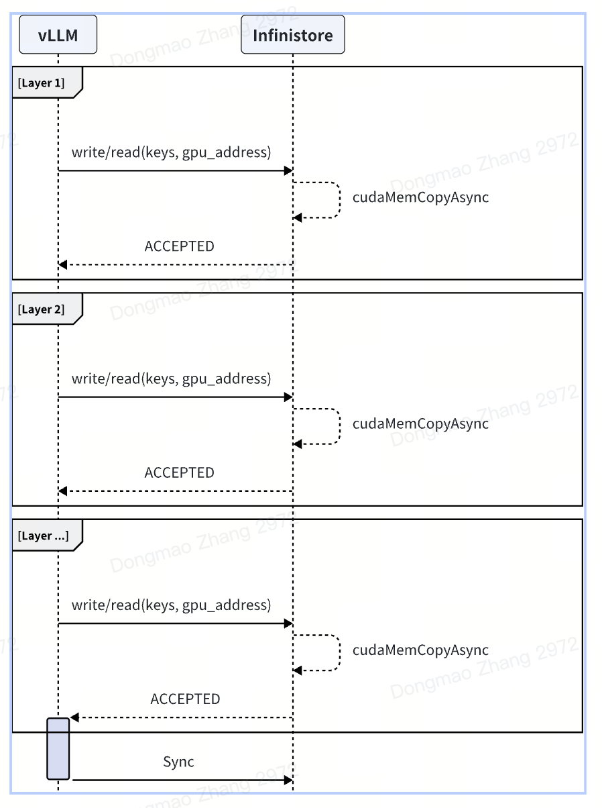
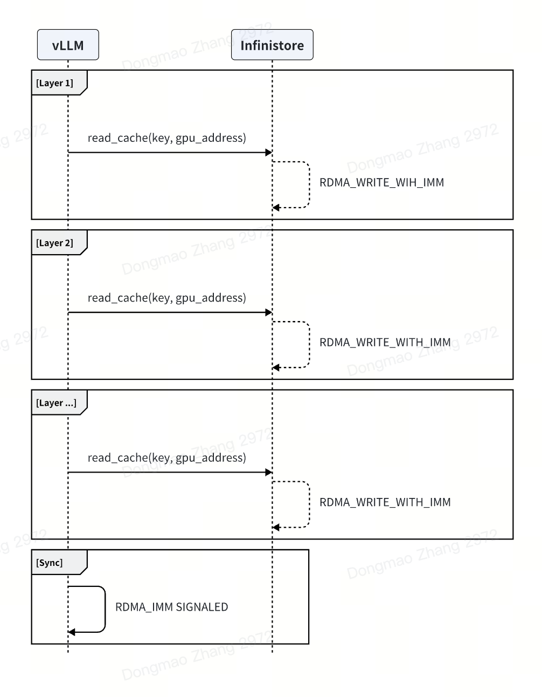

Design and Architecture
=======================

Introduction
------------

Motivation
~~~~~~~~~~
LLM inference is moving to disaggregated architecture.
LLM inference is moving from single-instance execution to cluster-level disaggregated architecture. Among all the efforts, prefill-decoding disaggregation is probably the most prominent change. The prefill phase requires more computational power, while the decode phase places a greater demand for memory. With this observation, prefill and decode phase disaggregation is an important aspect to improve inference engine performance.
In addition to prefill-decode disaggregation, distributed KV cache could also increase the prefix KV cache hit rate, leading to higher GPU resource utilization.
There are various related papers in this field, and some of them are even already in production:

  - Mooncake: Kimi's production serving platform. A global KV store is made up of distributed DDR and SSD on each GPU host.
  - Splitwise: A prefill-decode disaggregation system, which requires KV cache transfer between different machines.
  - AttentionStore: Similar to Mooncake but it considers multi-turn conversation inference with positional-encoding separation from KV cache on a single node.
  - MemServe: An elastic memory pool managing distributed memory and KV caches across serving instances.

We identified many innovative or potential improvements in this transition.
While analyzing the works above, we identified many potential improvements or new techniques to build a high-performance and scale cluster-level inference system, such as:

  - Improvements on the request schedulers to build a more extensible and scalable scheduler,
  - Integrating with specific inference engine features (like extending the existing APC feature in vLLM),
  - Some new algorithms to better scale the memory pool and re-balance the hot sequences,
  - Exploring some new techniques such as de-coupled positional encoding, etc.

We are trying to build a high-performance open-source implementation to incorporate all the potential innovations mentioned above, so that different customers don't have to build their own.

Features
--------

Compared to a single instance vLLM, vLLM + InfiniStore supports the following new features:

- Prefill-decoding architecture
- Historical KV cache in DRAM and SSD: a much larger pool than the current Automatic Prefix Cache (APC) feature in vLLM which is limited to GPU HBM.
- Cross-host KV cache: one host can reuse the historical KV cache on another host.

Architecture
------------

.. image:: img/arch.png
   :align: center

1. Infinistore and vLLM are deployed on the same server, reusing the local CPU and memory resources.

2. The memcopy speed within the same machine is significantly faster than RDMA. It is recommended to use local GPU copy when reading and writing to the local Infinistore.

3. Infinistore uses the traditional key-value structure, supporting variable-length keys. This facilitates storing information like model_id, request, and token hash in the key.
   Since RDMA memory registration is very slow, Infinistore pre-registers memory for RDMA during startup and implements memory management using a memory pool.
   The current memory management algorithms support bitmap or jemalloc, with bitmap being the default.

4. Read and Write Process:

   a. Prefill Stage:
      vLLM writes to the kvcache layer by layer during the prefill stage. Communication methods can be either local GPU copy or RDMA.
      Practical experience shows that the layer-by-layer approach parallelizes network communication and GPU computation. Measurements indicate that during the prefill stage, the network overhead increases by no more than 1%.
      For a demo implementation, refer to: demo_prefill.py

   b. Decode Stage:
      In the decode stage, a separate thread in vLLM downloads the kvcache and then notifies the scheduler to start the decoding process.
      Unlike the current community implementation of vLLM, to ensure that network operations do not block the GPU during the decode stage, an additional thread is required to download data.

Communications
--------------

local gpu copy
~~~~~~~~~~~~~~

rdma write
~~~~~~~~~~

.. image:: img/rdma_write.png
   :align: center

rdma read
~~~~~~~~~

